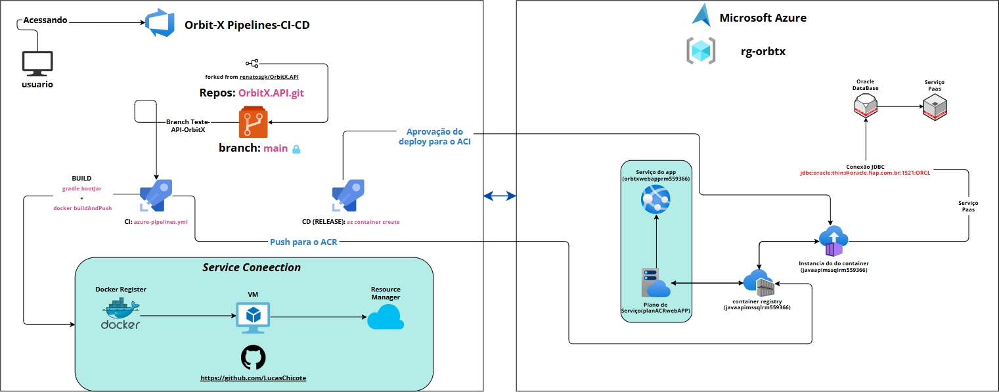

# Orbit X API — Pipeline CI/CD & CRUD Oracle Database
> **Projeto de DevOps — Pipeline CI/CD automatizada**
> API Spring Boot (Orbit X) integrada ao Oracle Database, com esteira CI/CD automatizada via Azure DevOps e deploy em nuvem via Azure Container Instances (ACI) e Azure Container Registry (ACR).

---

## Integrantes
- Fabio Henrique de Souza Eduardo → RM 560416
- Lucas Aurelio de Brito Chicote → RM 559366
- Gabriel Wu Castro → RM 560210
- Renato Kenji Sugaki → RM 559810

---

## Link do Projeto no Azure DevOps
```bash
https://dev.azure.com/GroupFoodly/OrbitX
```

---

## Arquitetura da Solução



---

| Camada | Tecnologia |
|--------|-----------|
| Linguagem | Java 17 + Spring Boot 3.2.5 |
| Segurança | Spring Security + JWT |
| Banco de Dados | Oracle Database 19c (FIAP PaaS) |
| ORM | Hibernate + JPA |
| Migrations | Flyway |
| Container | Docker (multi-stage build) |
| Registry | Azure Container Registry (ACR) |
| Deploy | Azure Container Instances (ACI) |
| CI/CD | Azure DevOps Pipelines |
| IA | Spring AI + Groq (LLaMA 3.3 70B) |
| Mensageria | RabbitMQ |

---

## Infraestrutura Provisionada

| Recurso | Nome | Região |
|---------|------|--------|
| Resource Group | `rg-orbtx` | Brazil South |
| Container Registry | `javaapimssqlrm559366` | Brazil South |
| Container Instance | `javaapimssqlrm559366` | Brazil South |
| Banco de Dados | Oracle (`oracle.fiap.com.br`) | Oracle PaaS |

---

## Estrutura do Repositório

```
OrbitX.API/
├── orbit-x-backend/
│   ├── src/
│   │   └── main/
│   │       ├── java/com/orbitx/backend/
│   │       │   ├── config/
│   │       │   ├── domain/
│   │       │   │   ├── auth/
│   │       │   │   ├── dashboard/
│   │       │   │   ├── infrastructure/
│   │       │   │   └── reports/
│   │       │   ├── security/
│   │       │   └── shared/
│   │       └── resources/
│   │           ├── db/migration/
│   │           │   ├── V1__create_schema.sql
│   │           │   ├── V2__seed_initial_data.sql
│   │           │   └── V7__seed_fleet_data.sql
│   │           ├── application.yml
│   │           └── application-prod.yml
│   └── Dockerfile
├── scripts/
│   ├── script-bd.sql
│   └── script-infra.sh
├── dockerfiles/
│   └── Dockerfile
├── azure-pipelines.yml
├── docker-compose.yml
└── README.md
```
---

## Scripts dos comandos para colocar no Cloud Shell do Portal Azure 
- infraACR.sh
- infra-aci-webapp

# Script para criar o grupo de recursos e o ACR (Azure Container Registry) infraACR.sh 

```bash
###
### Variáveis
###
grupoRecursos=rg-orbtx
# Altere a Região conforme orientação do Prof
regiao=brazilsouth
#Outras opções:
#brazilsouth
#eastus2
#westus
#westus2
# Altere para seu RM
rm=rm559366
nomeACR="javaapimssql$rm"
skuACR=Basic

###
### Criação do Grupo de Recursos
###
# Verifica a existência do grupo de recursos
if [ $(az group exists --name $grupoRecursos) = true ]; then
    echo "O grupo de recursos $grupoRecursos já existe"
else
    # Cria o grupo de recursos
    az group create --name $grupoRecursos --location $regiao
    echo "Grupo de recursos $grupoRecursos criado na localização $regiao"
fi

###
### Criação do Azure Container Registry
###
# Verifica se o ACR já existe
if az acr show --name $nomeACR --resource-group $grupoRecursos &> /dev/null; then
    echo "O ACR $nomeACR já existe"
else
    # Cria o ACR
    az acr create --resource-group $grupoRecursos --name $nomeACR --sku $skuACR
    echo "ACR $nomeACR criado com sucesso"
    # Habilita o Usuário Administrador no Azure Container Registry
    az acr update --name $nomeACR --resource-group $grupoRecursos --admin-enabled true
    echo "Habilitado com sucesso o usuário Administrador para o ACR $nomeACR"
fi

#
# Essa parte do Script só é recomendada para fins de testes e aprendizado
#
# WARNING: [Warning] This output may compromise security by showing secrets. Learn more at: https://go.microsoft.com/fwlink/?linkid=2258669
#
# Recuperar as credenciais do usuário administrador, armazenar em variáveis de ambiente e mostrar as credenciais
ADMIN_USER=$(az acr credential show --name $nomeACR --query "username" -o tsv)
ADMIN_PASSWORD=$(az acr credential show --name $nomeACR --query "passwords[0].value" -o tsv)

# Cria variáveis de ambiente
export ACR_ADMIN_USER=$ADMIN_USER
export ACR_ADMIN_PASSWORD=$ADMIN_PASSWORD

# Mostra as variáveis de ambiente
echo $ACR_ADMIN_USER
echo $ACR_ADMIN_PASSWORD
```
---
# Script para criar a aplicação de serviço (webapp) e o ACI (Container Instance) infra-aci-webapp.sh

```bash
###
### Variáveis
###
grupoRecursos=rg-orbtx
# Altere para seu RM
rm=rm559366
nomeACR="javaapimssql$rm"
imageACR="javaapimssql$rm.azurecr.io/javaapisql:latest"
serverACR="javaapimssql$rm.azurecr.io"
userACR=$(az acr credential show --name $nomeACR --query "username" -o tsv)
passACR=$(az acr credential show --name $nomeACR --query "passwords[0].value" -o tsv)
nomeACI="javaapimssql$rm"
# Altere a Região conforme orientação do Prof
regiao=brazilsouth
#Outras opções:
#brazilsouth
#eastus2
#westus
#westus2
planService=planACRWebApp
sku=F1
appName="orbtxwebapp$rm"
imageACR="javaapimssql$rm.azurecr.io/javaapisql:latest"
port=80

###
### Criação do ACI
###
az container create \
    --resource-group $grupoRecursos \
    --name $nomeACI \
    --image $imageACR \
    --cpu 1 \
    --memory 1 \
    --os-type Linux \
    --registry-login-server $serverACR \
    --registry-username $userACR \
    --registry-password $passACR \
    --dns-name-label $nomeACI \
    --restart-policy Always \
    --ports 80

###
### Criação do Web App
###

### Cria o Plano de Serviço se não existir
if az appservice plan show --name $planService --resource-group $grupoRecursos &> /dev/null; then
    echo "O plano de serviço $planService já existe"
else
    az appservice plan create --name $planService --resource-group $grupoRecursos --is-linux --sku $sku
    echo "Plano de serviço $planService criado com sucesso"
fi 
### Cria o Serviço de Aplicativo se não existir
if az webapp show --name $appName --resource-group $grupoRecursos &> /dev/null; then
    echo "O Serviço de Aplicativo $appName já existe"
else
    az webapp create --resource-group $grupoRecursos --plan $planService --name  $appName --deployment-container-image-name $imageACR
    echo "Serviço de Aplicativo $appName criado com sucesso"
fi
### Cria uma variável definindo a porta do Serviço de Aplicativo
if az webapp show --name $appName --resource-group $grupoRecursos > /dev/null 2>&1; then
    az webapp config appsettings set --resource-group $grupoRecursos --name $appName --settings WEBSITES_PORT=$port
    echo "Serviço de Aplicativo $appName configurado para escutar na porta $port com sucesso"
fi
```
---
### script-infra.sh — Resource Group + ACR + ACI

```bash
grupoRecursos=rg-orbtx
regiao=brazilsouth
rm=rm559366
nomeACR="javaapimssql$rm"
nomeACI="javaapimssql$rm"
skuACR=Basic

# Resource Group
if [ $(az group exists --name $grupoRecursos) = true ]; then
    echo "Resource Group $grupoRecursos já existe"
else
    az group create --name $grupoRecursos --location $regiao
    echo "Resource Group $grupoRecursos criado"
fi

# Azure Container Registry
if az acr show --name $nomeACR --resource-group $grupoRecursos &> /dev/null; then
    echo "ACR $nomeACR já existe"
else
    az acr create --resource-group $grupoRecursos --name $nomeACR --sku $skuACR
    az acr update --name $nomeACR --resource-group $grupoRecursos --admin-enabled true
    echo "ACR $nomeACR criado"
fi

serverACR="$nomeACR.azurecr.io"
userACR=$(az acr credential show --name $nomeACR --query "username" -o tsv)
passACR=$(az acr credential show --name $nomeACR --query "passwords[0].value" -o tsv)

# Azure Container Instance
az container delete \
  --resource-group $grupoRecursos \
  --name $nomeACI \
  --yes || true

az container create \
  --resource-group $grupoRecursos \
  --name $nomeACI \
  --image $serverACR/javaapirp:latest \
  --cpu 1 \
  --memory 1 \
  --os-type Linux \
  --registry-login-server $serverACR \
  --registry-username $userACR \
  --registry-password $passACR \
  --dns-name-label $nomeACI \
  --restart-policy Always \
  --ports 8080 \
  --environment-variables \
    SPRING_PROFILES_ACTIVE="prod" \
    DATABASE_URL="jdbc:oracle:thin:@oracle.fiap.com.br:1521:ORCL" \
    DATABASE_USERNAME="$DATABASE_USERNAME" \
    DATABASE_PASSWORD="$DATABASE_PASSWORD" \
    DATABASE_SCHEMA="$DATABASE_SCHEMA" \
    JWT_SECRET="$JWT_SECRET" \
    PORT="8080" \
    SPRING_AUTOCONFIGURE_EXCLUDE="org.springframework.boot.autoconfigure.amqp.RabbitAutoConfiguration"

echo "Container $nomeACI criado com sucesso"
echo "URL: http://$nomeACI.$regiao.azurecontainer.io:8080/swagger-ui.html"
```

---

## DDL das Tabelas (script-bd.sql — executado via Flyway)

```sql
CREATE TABLE companies (
    id          NUMBER(19)    GENERATED BY DEFAULT ON NULL AS IDENTITY PRIMARY KEY,
    name        VARCHAR2(100) NOT NULL,
    tax_id      VARCHAR2(20)  NOT NULL,
    admin_email VARCHAR2(150) NOT NULL,
    plan        VARCHAR2(20)  DEFAULT 'ENTERPRISE' NOT NULL,
    created_at  TIMESTAMP     DEFAULT SYSTIMESTAMP NOT NULL,
    CONSTRAINT uq_companies_tax_id UNIQUE (tax_id)
);

CREATE TABLE users (
    id          NUMBER(19)    GENERATED BY DEFAULT ON NULL AS IDENTITY PRIMARY KEY,
    name        VARCHAR2(100) NOT NULL,
    email       VARCHAR2(150) NOT NULL,
    password    VARCHAR2(255) NOT NULL,
    role        VARCHAR2(20)  DEFAULT 'ADMIN' NOT NULL,
    company_id  NUMBER(19)    NOT NULL,
    created_at  TIMESTAMP     DEFAULT SYSTIMESTAMP NOT NULL,
    last_login  TIMESTAMP,
    active      NUMBER(1)     DEFAULT 1 NOT NULL,
    CONSTRAINT uq_users_email   UNIQUE (email),
    CONSTRAINT fk_users_company FOREIGN KEY (company_id) REFERENCES companies(id) ON DELETE CASCADE
);

CREATE TABLE datacenters (
    id                       NUMBER(19)    GENERATED BY DEFAULT ON NULL AS IDENTITY PRIMARY KEY,
    name                     VARCHAR2(150) NOT NULL,
    city                     VARCHAR2(100) NOT NULL,
    country                  VARCHAR2(100) NOT NULL,
    latitude                 BINARY_DOUBLE NOT NULL,
    longitude                BINARY_DOUBLE NOT NULL,
    thermal_state            VARCHAR2(20)  DEFAULT 'STABLE' NOT NULL,
    regional_consumption_kwh NUMBER(12,2),
    capacity_servers         NUMBER(10),
    active                   NUMBER(1)     DEFAULT 1 NOT NULL,
    created_at               TIMESTAMP     DEFAULT SYSTIMESTAMP NOT NULL
);

CREATE TABLE satellites (
    id                  NUMBER(19)    GENERATED BY DEFAULT ON NULL AS IDENTITY PRIMARY KEY,
    name                VARCHAR2(100) NOT NULL,
    orbit_type          VARCHAR2(10)  NOT NULL,
    altitude_km         BINARY_DOUBLE NOT NULL,
    inclination_deg     BINARY_DOUBLE NOT NULL,
    orbital_period_min  BINARY_DOUBLE NOT NULL,
    data_link_status    VARCHAR2(20)  DEFAULT 'ACTIVE' NOT NULL,
    active              NUMBER(1)     DEFAULT 1 NOT NULL,
    launched_at         TIMESTAMP,
    CONSTRAINT uq_satellites_name UNIQUE (name)
);

CREATE TABLE alerts (
    id               NUMBER(19)     GENERATED BY DEFAULT ON NULL AS IDENTITY PRIMARY KEY,
    title            VARCHAR2(200)  NOT NULL,
    message          VARCHAR2(4000) NOT NULL,
    severity         VARCHAR2(20)   NOT NULL,
    source_component VARCHAR2(100),
    datacenter_id    NUMBER(19)     REFERENCES datacenters(id) ON DELETE SET NULL,
    resolved         NUMBER(1)      DEFAULT 0 NOT NULL,
    created_at       TIMESTAMP      DEFAULT SYSTIMESTAMP NOT NULL,
    resolved_at      TIMESTAMP
);
```

---

## Pipeline CI/CD no Azure DevOps

1. **Azure Boards** — Tasks criadas e acompanhadas até a conclusão
2. **Branch de feature** — Desenvolvimento na branch `Teste-API-OrbitX`, isolando da `main`
3. **Pull Request** — Abertura, revisão e merge para `main`
4. **Pipeline CI** — `azure-pipelines.yml` faz build da imagem Docker e publica no ACR
5. **Release CD** — Deploy automático no ACI após novo artefato

### azure-pipelines.yml

```yaml
trigger:
  - Teste-API-OrbitX
pool:
  vmImage: ubuntu-latest
stages:
  - stage: Build
    displayName: "Build e Push para ACR"
    jobs:
      - job: BuildAndPush
        steps:
          - task: Docker@2
            displayName: "Build e Push da imagem"
            inputs:
              containerRegistry: "javaapimssqlrm559366"
              repository:        "javaapirp"
              command:           "buildAndPush"
              Dockerfile:        "**/Dockerfile"
              tags: |
                $(Build.BuildId)
                latest
```

---

## URLs da Aplicação em Nuvem

| Ambiente | URL |
|----------|-----|
| Azure Container Instances | `http://javaapimssqlrm559366.brazilsouth.azurecontainer.io:8080` |
| Swagger UI | `http://javaapimssqlrm559366.brazilsouth.azurecontainer.io:8080/swagger-ui.html` |

---

## Testes de CRUD via Swagger / Postman

> **URL base:** `http://javaapimssqlrm559366.brazilsouth.azurecontainer.io:8080`

### Autenticação

#### Register (Create)
- **Método:** `POST`
- **URL:** `/api/v1/auth/register`
```json
{
  "companyName": "Orbit X Corp",
  "taxId": "12345678000199",
  "adminName": "Lucas",
  "email": "lucas@orbitx.com",
  "password": "senha123"
}
```

#### Login
- **Método:** `POST`
- **URL:** `/api/v1/auth/login`
```json
{
  "email": "lucas@orbitx.com",
  "password": "senha123"
}
```
> Copie o `accesToken` retornado e cole no **Authorize** para fazer as próximas realizações do CRUD, se for via Swagger
> Copie o `accesToken` retornado e use como **Bearer Token** nas próximas requisições, se for via Postaman
---

### CRUD de datacenters

#### Criar datacenters (Create)
- **Método:** `POST`
- **URL:** `/api/v1/infrastructure/datacenters`
```json
{
  "name": "Orbit X - Sao Paulo Alpha",
  "city": "Sao Paulo",
  "country": "Brazil",
  "latitude": -23.5505,
  "longitude": -46.6333,
  "thermalState": "STABLE",
  "regionalConsumptionKwh": 18500.00,
  "capacityServers": 4200
}
```
#### Atualizar datacenters (Update)
- **Método:** `PUT`
- **URL:** `/api/v1/infrastructure/datacenters/{id}`
```json
{
  "name": "Orbit X - Sao Paulo Alpha",
  "city": "Sao Paulo",
  "country": "Brazil",
  "latitude": -23.5505,
  "longitude": -46.6333,
  "thermalState": "OPTIMAL",
  "regionalConsumptionKwh": 19000.00,
  "capacityServers": 4500
}
```

#### Deletar datacenters (Delete)
- **Método:** `DELETE`
- **URL:** `/api/v1/infrastructure/datacenters/{id}`


#### Listar datacenters (Read)
- Mostrar persistencia de dados
```sql
select * from datacenters;
```
---

### CRUD de Satélites

#### Criar satellites (Create)
- **Método:** `POST`
- **URL:** `/api/v1/infrastructure/satellites`
```json
{
  "name": "OX-SAT-01 Atlas",
  "orbitType": "LEO",
  "altitudeKm": 550.0,
  "inclinationDeg": 53.0,
  "orbitalPeriodMin": 95.5,
  "dataLinkStatus": "ACTIVE",
  "launchedAt": "2023-03-15T10:00:00Z"
}
```
#### Atualizar satellites (Update)
- **Método:** `PUT`
- **URL:** `/api/v1/infrastructure/satellites/{id}`
```json
{
  "name": "OX-SAT-01 Atlas",
  "orbitType": "LEO",
  "altitudeKm": 560.0,
  "inclinationDeg": 53.0,
  "orbitalPeriodMin": 95.5,
  "dataLinkStatus": "DEGRADED",
  "launchedAt": "2023-03-15T10:00:00Z"
}
```

#### Deletar satellites (Delete)
- **Método:** `DELETE`
- **URL:** `/api/v1/infrastructure/satellites/{id}`
---

#### Listar satellites (Read)
- Mostrar persistencia de dados
```sql
select * from satellites;
```

### CRUD de Alertas

#### Criar alerts (Create)
- **Método:** `POST`
- **URL:** `/api/v1/dashboard/alerts`
```json
{
  "title": "Risco Térmico Crítico",
  "message": "Temperatura acima do limite no datacenter de Tokyo.",
  "severity": "CRITICAL",
  "sourceComponent": "AI_ENGINE",
  "datacenterId": 1
}
```

#### Listar alerts (Read)
- Mostrar persistencia de dados
```sql
select * from alerts;
```

#### Atualizar alerts (Update)
- **Método:** `PUT`
- **URL:** `/api/v1/dashboard/alerts/{id}`
```json
{
  "title": "Risco Térmico Atualizado",
  "message": "Temperatura normalizada após ativação do sistema de resfriamento.",
  "severity": "LOW",
  "sourceComponent": "AI_ENGINE",
  "datacenterId": 1
}
```

#### Resolver alerts (Patch)
- **Método:** `PATCH`
- **URL:** `/api/v1/dashboard/alerts/{id}/resolve`

#### Deletar alerts (Delete)
- **Método:** `DELETE`
- **URL:** `/api/v1/dashboard/alerts/{id}`

---

## Evidência de Persistência no Banco (Oracle — SQL Developer)

```sql
select * from users;
select * from datacenters;
select * from satellites;
select * from alerts;
select * from companies;
```
